# 🤖 LangChain Filesystem Context

> Context-Aware AI Agents Powered by Your Local Files

[](https://www.python.org/) [](https://langchain.com/) [](https://github.com/astral-sh/uv) [](https://opensource.org/licenses/MIT)

Tired of AI agents with limited memory? This project demonstrates how to supercharge LangChain agents by giving them direct access to your local file system. The agent can intelligently search, read, and use information from your documents to provide rich, context-aware answers.

This project is a practical implementation of the concepts from the [LangChain blog post: &#34;How Agents Can Use Filesystems for Context Engineering&#34;](https://blog.langchain.com/how-agents-can-use-filesystems-for-context-engineering/).

## 🧠 How It Worksex

The system uses a Retrieval-Augmented Generation (RAG) approach. Instead of relying solely on its pre-trained knowledge, the agent first retrieves relevant information from your files and then uses that information to generate a precise answer.

Here's the architecture flow:

```mermaid
graph TD
    %% Define styles for visual appeal
    classDef userStyle fill:#e1f5fe,stroke:#01579b,stroke-width:2px,color:#000;
    classDef agentStyle fill:#f3e5f5,stroke:#4a148c,stroke-width:2px,color:#000;
    classDef toolStyle fill:#e8f5e9,stroke:#1b5e20,stroke-width:2px,color:#000;
    classDef dataStyle fill:#fff3e0,stroke:#e65100,stroke-width:2px,color:#000;
    classDef processStyle fill:#fce4ec,stroke:#880e4f,stroke-width:2px,color:#000;

    %% Nodes
    UserQuery["👤 User Query<br/>('What is the history of AI?')"]:::userStyle
    Agent["🤖 LangChain Agent"]:::agentStyle
    FinalAnswer["✅ Final Answer<br/>(Based on your documents)"]:::userStyle

    subgraph "Agent's Tools"
        SearchTool["🔍 1. Document Search<br/>(Tool Usage)"]:::toolStyle
        Synthesize["🧠 2. Synthesize Answer"]:::processStyle
    end

    subgraph "Knowledge Base"
        VectorStore["💾 Vector Store<br/>(FAISS + Embeddings)"]:::dataStyle
        LocalFiles["📁 Your Local Files<br/>(data/docs/)"]:::dataStyle
    end

    %% Flow of data and control
    UserQuery --> Agent;
    Agent -- "Decides to search" --> SearchTool;
    SearchTool -- "Queries for relevant chunks" --> VectorStore;
    VectorStore -- "Returns document chunks" --> SearchTool;
    SearchTool -- "Returns results" --> Agent;
    Agent -- "Uses results to synthesize" --> Synthesize;
    Synthesize --> FinalAnswer;

    %% Define the relationship between Local Files and Vector Store
    LocalFiles --> VectorStore;
```



## ✨ Key Features

- **📁 Dynamic Document Indexing**: Easily add `.txt`, `.pdf`, and other file types to the agent's knowledge base.
- **🔍 Intelligent Search**: Uses FAISS and OpenAI embeddings to find the most relevant document chunks for any query.
- **🤖 Multi-Provider LLM Support**: Seamlessly switch between different models from OpenAI and OpenRouter (including free models!).
- **🛠️ Tool-Based Agents**: The agent is equipped with tools (`document_search`, `file_reader`) to reason and act.
- **🗣️ Interactive Mode**: Chat with your agent in a user-friendly command-line interface.

## 🛠️ Tech Stack

- **🐍 Language**: Python 3.12+
- **📦 Package Manager**: `uv`
- **🦜 Framework**: LangChain
- **🧠 Vector Store**: FAISS
- **🤖 Models**: OpenAI, OpenRouter (Anthropic, xAI, Google, etc.)
- **🔧 Build Backend**: Hatchling

## 🚀 Getting Started

### Prerequisites

1. **Python 3.12+**: Make sure you have a recent version of Python installed.
2. **uv**: Install the lightning-fast Python package manager.
   ```powershell
   # On Windows
   irm https://astral.sh/uv/install.ps1 | iex

   # On macOS/Linux
   curl -LsSf https://astral.sh/uv/install.sh | sh
   ```
3. **API Keys**: Get your API keys from the providers you want to use.
   - [OpenAI API Key](https://platform.openai.com/api-keys)
   - [OpenRouter API Key](https://openrouter.ai/keys)

### Installation & Setup

1. **Clone the repository:**

   ```bash
   git clone https://github.com/ashishpatel26/langchain-filesystem-context.git
   cd langchain-filesystem-context
   ```
2. **Install dependencies with `uv`:**

   ```bash
   uv sync
   ```
3. **Create a `.env` file** in the root directory and add your API keys:

   ```ini
   # .env file

   # Required for OpenAI models
   OPENAI_API_KEY=sk-your-openai-key-here

   # Required for OpenRouter models
   OPENROUTER_API_KEY=sk-or-your-openrouter-key-here

   # (Optional) Set a default provider and model
   DEFAULT_LLM_PROVIDER=openrouter
   OPENROUTER_MODEL=anthropic/claude-3-haiku
   ```

## 📖 Usage

### 1. Add Documents

First, add some documents to the `data/documents` folder. Then, run the indexing command to make them available to the agent.

```bash
# Index all files in the data/documents directory
uv run python -m src.main --add-docs data/documents
```

### 2. Ask a Single Question

You can ask a one-off question directly from the command line.

```bash
# Using the default OpenAI model
uv run python -m src.main --query "What are the key design philosophies of Python?"

# Using a specific model from OpenRouter
uv run python -m src.main --provider openrouter --model "x-ai/grok-2-mini:free" --query "Summarize the history of AI."
```

### 3. Run in Interactive Mode (Recommended)

The best way to use the agent is in interactive chat mode.

```bash
# Start with the default provider/model
uv run python -m src.main --interactive

# Start with a specific OpenRouter model
uv run python -m src.main --provider openrouter --model "anthropic/claude-3-sonnet" --interactive
```

Now you can have a conversation with your agent!

```
File System Context Agent - Interactive Mode
Type 'exit' to quit.

You: What is the history of AI?
Agent: [The agent will search your documents and provide a detailed answer...]

You: Who created Python?
Agent: [The agent will find the relevant document and answer...]
```

## 📂 Project Structure

```
langchain-filesystem-context/
├── .env                      # <-- Your API keys (create this)
├── .gitignore
├── pyproject.toml            # <-- Project dependencies and metadata
├── README.md                 # <-- This file
├── data/
│   ├── documents/            # <-- Add your .txt, .pdf files here
│   └── vector_db/            # <-- The generated FAISS index (auto-created)
│
└── src/
    ├── agents/
    │   └── file_system_agent.py
    ├── config.py
    ├── main.py
    ├── tools/
    │   ├── document_processor.py
    │   └── file_reader.py
    └── utils/
        ├── file_indexer.py
        └── llm_factory.py
```

## 🙏 Acknowledgments

- This project is inspired by the excellent [LangChain blog post on filesystem context](https://blog.langchain.com/how-agents-can-use-filesystems-for-context-engineering/).
- Built with the powerful [LangChain](https://langchain.com/) framework.
- Thanks to [OpenRouter](https://openrouter.ai/) for providing easy access to a wide variety of open-source and commercial models.

---

Made with ❤️ by [ashishpatel](https://www.linkedin.com/in/ashishpatel2604/)
